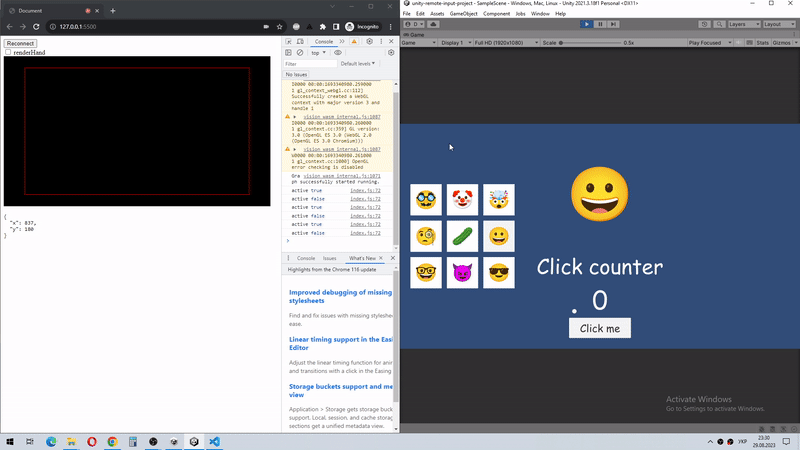

# unity-remote-input-project

### Description
This project demonstrates how to control running instance of **Unity** game using hand gestures.

I spent about **26** hours working on this project (including research and development).

[**Assets**](/Assets) folder contains demo files (used in showcase), all logic is located in [**custom package**](/Packages/unity-remote-input).

### How it works
- **Unity** instance runs **WebSocket Server** on port **7000** and receives messages from the client.
- In this implementation web-browser is used as a client. Client-side logic is implemented in [**separate repository**](https://github.com/kukumberman/remote-input-web-client).

### Restrictions
- Browser tab should be visible (not minimized) in order to send messages via websocket.
- **Game View** should be active in order to dispatch events for **UI Event System**.

### Showcase

